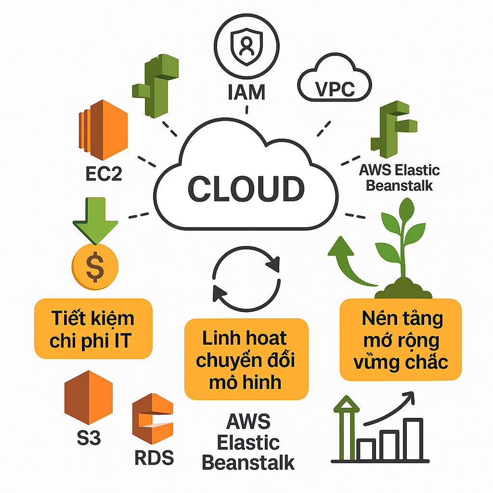

**DỰ ÁN: HỆ THỐNG WEBSITE BÁN ĐIỆN THOẠI PHP TRÊN AWS**

**Đề Tài : Xây dựng nền tảng bán lẻ điện thoại hiện đại, an toàn, linh
hoạt với AWS Elastic Beanstalk**

Trường: Đại Học Công Nghệ Thành Phố Hồ Chí Minh

Họ và tên : Nguyễn Bảo Nhân

Lớp: 21DTHA4

MSSV:2180603539

Đơn vị thực tập: Amazon Web Services (AWS)

Vị trí: FCJ Trainee

# Tóm tắt điều hành

## 1. Bối cảnh & Động lực triển khai

\- Thị trường bán lẻ điện thoại di động đang bước vào giai đoạn cạnh
tranh khốc liệt, với hàng ngàn đại lý trực tuyến và khách hàng ngày càng
ưu tiên mua sắm qua Internet. Tuy nhiên, đa phần các website bán lẻ hiện
tại ở Việt Nam vẫn sử dụng mô hình server vật lý hoặc VPS truyền thống.
Điều này dẫn đến các vấn đề về hiệu suất, bảo mật, khó mở rộng và vận
hành thủ công tốn kém.

**Các hiện tượng thường thấy:**

\- Website chậm, dễ bị nghẽn vào giờ cao điểm hoặc khi chạy Flash Sale.

\- Khó mở rộng hệ thống khi doanh nghiệp tăng trưởng nhanh.

\- Dữ liệu rời rạc, backup thủ công, bảo mật yếu.

\- Đội ngũ IT mất nhiều thời gian cho bảo trì, xử lý sự cố, không thể
tập trung vào đổi mới.

\- Cạnh tranh trên thị trường số buộc các doanh nghiệp phải đổi mới công
nghệ, tự động hóa vận hành, nâng cao trải nghiệm khách hàng, bảo vệ dữ
liệu và tối ưu hóa chi phí.

## 2. Mục tiêu và Giải pháp đề xuất

**Mục tiêu cốt lõi của dự án:**

\- Tạo ra nền tảng website bán điện thoại hiện đại, phục vụ đồng thời
hàng nghìn khách hàng.

\- Tự động mở rộng quy mô hạ tầng khi có đột biến truy cập
(auto-scaling).

\- Quản trị tập trung toàn bộ dữ liệu: sản phẩm, đơn hàng, tồn kho,
khách hàng.

\- Tăng tốc độ website, tối ưu trải nghiệm người dùng, giảm thời gian
downtime gần như bằng 0.

\- Tích hợp dễ dàng các công cụ marketing, bán hàng, phân tích dữ liệu
và mở rộng thêm module mới trong tương lai.

**Giải pháp được lựa chọn:**

\- Ứng dụng PHP backend triển khai trên AWS Elastic Beanstalk -- tự động
triển khai, cập nhật, mở rộng cho các ứng dụng web.

\- Amazon S3 lưu trữ và phục vụ ảnh sản phẩm, tài liệu, media với tốc độ
cao và độ bền dữ liệu gần như tuyệt đối.

\- Amazon RDS (MySQL) quản lý dữ liệu nghiệp vụ, hỗ trợ tự động backup,
phục hồi khi cần thiết, bảo mật nhiều lớp.

\- Amazon EC2 hỗ trợ các tác vụ batch, worker, đồng bộ dữ liệu hoặc
backup quy mô lớn mà Beanstalk không đảm nhiệm.

\- HeidiSQL giúp đội ngũ vận hành quản trị CSDL chuyên sâu, backup và
phục hồi chủ động.

\- Toàn bộ hệ thống xây dựng trên nền tảng bảo mật AWS (VPC, IAM, mã hóa
dữ liệu), tuân thủ chuẩn vận hành, backup và giám sát liên tục.

##  Lợi ích nổi bật của hệ thống

### Về kỹ thuật:

> \- Khả năng mở rộng linh hoạt: Tự động tăng giảm số lượng server theo
> nhu cầu thực tế, không sợ nghẽn khi chạy chiến dịch lớn.
>
> \- Hiệu năng tối ưu: Thời gian tải trang nhanh, đáp ứng tốt truy vấn
> sản phẩm, đặt hàng, quản lý kho, kể cả với hàng chục nghìn người dùng
> đồng thời.
>
> \- Bảo mật cao: Dữ liệu được bảo vệ đa lớp (mã hóa, phân quyền IAM,
> VPC riêng), giảm nguy cơ rò rỉ/lộ dữ liệu khách hàng.
>
> \- Backup & phục hồi chủ động: Dữ liệu luôn được sao lưu định kỳ tự
> động trên Amazon RDS và S3; dễ dàng phục hồi khi gặp sự cố.
>
> \- Quản trị tiện lợi: Đội vận hành dùng HeidiSQL quản trị, kiểm tra,
> chỉnh sửa dữ liệu nhanh, bảo mật.

### Về vận hành & kinh doanh:

> \- Tối ưu chi phí: Chỉ trả phí theo mức sử dụng thực tế
> (pay-as-you-go), giảm đầu tư ban đầu, dễ dàng tăng/giảm cấu hình.
>
> \- Tăng trưởng không giới hạn: Mở rộng ngành hàng mới, tích hợp CRM,
> Loyalty, Chatbot... nhanh chóng.
>
> \- Đáp ứng chiến dịch lớn: Website sẵn sàng phục vụ Flash Sale, ra mắt
> sản phẩm mới mà không lo quá tải.
>
> \- Trải nghiệm khách hàng xuất sắc: Hoạt động ổn định, tốc độ nhanh,
> giao dịch trơn tru, hình ảnh sắc nét.
>
> \- Nâng cao uy tín thương hiệu: Sở hữu hệ thống công nghệ hiện đại,
> tạo niềm tin mạnh mẽ với khách hàng.

## Định hướng phát triển dài hạn

> **Dễ dàng tích hợp:** Thêm module mới như quản lý bảo hành, giao nhận,
> phân tích dữ liệu, AI gợi ý sản phẩm.
>
> **Tối ưu vận hành:** Giảm nhân sự IT, chuyển nguồn lực sang phát triển
> sản phẩm/dịch vụ mới.
>
> **Sẵn sàng đa kênh:** Website kết nối API với mobile app, chatbot,
> ERP, hệ sinh thái AWS...

# 1. Tuyên bố vấn đề

## 1.1. Tình hình hiện tại

\- Host trên VPS/server vật lý, backup thủ công, khó mở rộng, dễ bị
nghẽn khi traffic cao.

## 1.2. Thách thức chính

\- Không chịu được tải lớn, bảo mật yếu, IT mất nhiều thời gian bảo trì.

## 1.3. Tác động của bên liên quan

\- Khách hàng: truy cập chậm, dễ rời bỏ.

\- Doanh nghiệp: mất doanh thu, uy tín, tăng chi phí IT.

\- IT: áp lực, burnout.

## 1.4. Hậu quả kinh doanh

\- Doanh số giảm, mất thị phần, chi phí vận hành tăng, khó mở rộng.

# 2. Kiến trúc giải pháp

## 2.1. Tổng quan về kiến trúc

\- Chuyển lên AWS: Elastic Beanstalk (PHP), S3 (ảnh), RDS (MySQL), EC2
(batch/worker), HeidiSQL (quản trị DB), tất cả trong VPC bảo mật, tích
hợp

{width="5.9944444444444445in"
height="7.204166666666667in"}

**2.2.1 Hình ảnh demo trang web khi triển khai trên AWS**

**Link truy cập:**
[http://ban-dien-thoai-env.eba-bgd8askn.ap-southeast-1.elasticbeanstalk.com/](https://elib.vku.udn.vn/bitstream/123456789/4102/1/21IT.T007-19IT6-Nguyen%20Vu%20Phuc-DATN.pdf)

{width="5.990972222222222in"
height="3.079861111111111in"}

{width="5.990972222222222in"
height="1.96875in"}

Hình ảnh trên laptop

{width="3.4930555555555554in"
height="5.027777777777778in"}{width="2.714583333333333in"
height="4.324305555555555in"}

Hình ảnh trên mobile

## 

## 2.2. Dịch vụ AWS đã sử dụng

\- Elastic Beanstalk: Deploy, scaling ứng dụng PHP

{width="5.986111111111111in"
height="2.5479166666666666in"}

\- S3: Lưu trữ ảnh/media, backup

{width="5.990277777777778in"
height="2.729861111111111in"}

\- RDS (MySQL): Dữ liệu, backup tự động, multi-AZ

{width="5.9875in" height="1.2375in"}

{width="5.9847222222222225in"
height="2.6979166666666665in"}

\- EC2: Batch/worker, backup lớn, tích hợp bảo mật

{width="5.990972222222222in"
height="1.3402777777777777in"}

{width="5.990277777777778in"
height="2.640277777777778in"}

\- HeidiSQL: Quản trị DB, backup/restore

{width="5.65in"
height="3.9583333333333335in"}

{width="5.9847222222222225in"
height="3.077777777777778in"}

## 2.3. Thiết kế thành phần

\- Frontend: Web/mobile responsive, SEO, tải nhanh

\- Backend (PHP): Quản lý nghiệp vụ, xác thực, kết nối S3, RDS

\- HeidiSQL: Quản trị CSDL, backup, kiểm tra dữ liệu

{width="6.0in"
height="3.0743055555555556in"}

## 2.4. Kiến trúc bảo mật

\- VPC riêng, security group kiểm soát chặt chẽ

\- Dữ liệu mã hóa khi lưu/truyền

\- IAM role tối thiểu, CloudWatch cảnh báo

{width="5.9944444444444445in"
height="5.9944444444444445in"}

## 

## 2.5. Thiết kế khả năng mở rộng

\- Elastic Beanstalk auto-scaling, S3 không giới hạn, RDS có thể scale,
EC2 worker mở rộng khi cần

{width="5.999305555555556in"
height="5.284027777777778in"}

# 3. Triển khai kỹ thuật

## 3.1. Các giai đoạn triển khai

1\. Phân tích, thiết kế chi tiết (1 tuần)

2\. Khởi tạo AWS: VPC, S3, RDS, EC2, Beanstalk (1 tuần)

3\. Điều chỉnh, tối ưu code PHP (1 tuần)

4\. Deploy lên Beanstalk, tích hợp dịch vụ (1 tuần)

5\. Di chuyển dữ liệu, kiểm thử toàn hệ thống (1 tuần)

6\. Go-live, hỗ trợ, giám sát (1 tuần)

## 3.2. Yêu cầu kỹ thuật

\- PHP 8.x, MySQL 8.x, AWS SDK/S3/EC2, IAM role, VPC riêng, security
group, SSH tunnel cho HeidiSQL, CI/CD pipeline (tùy chọn)

## 3.3. Phương pháp phát triển

\- Quản lý Git, môi trường staging/prod, tách file cấu hình, quy trình
rollback rõ ràng

## 3.4. Chiến lược thử nghiệm

\- Kiểm thử chức năng, bảo mật, hiệu năng, load test, test
backup/restore

## 3.5. Kế hoạch triển khai

\- Deploy staging/UAT, go-live giờ thấp điểm, theo dõi logs, tối ưu sau
triển khai

# 4. Dòng thời gian & Các mốc quan trọng

  ----------------------------------- -----------------------------------
  Giai đoạn                           Thời gian

  Phân tích & thiết kế                1 tuần

  AWS environment                     1 tuần

  Phát triển & tích hợp               1 tuần

  Triển khai thử nghiệm               1 tuần

  Kiểm thử & di chuyển                1 tuần

  Go-live & hỗ trợ                    1 tuần

  Tổng cộng                           7 tuần
  ----------------------------------- -----------------------------------

## 4.2. Các mốc quan trọng

\- Ký duyệt yêu cầu, hoàn tất phân tích

\- Deploy thành công, kiểm thử UAT

\- Go-live, báo cáo hoàn thành

## 4.3. Sự phụ thuộc

\- Quyền AWS, source code, dữ liệu, đội triển khai

## 4.4. Phân bổ nguồn lực

\- 1 PM, 2 PHP Dev, 1 DevOps, 1 Tester

{width="5.9944444444444445in"
height="5.392361111111111in"}

# 5. Ước tính ngân sách

## 5.1. Chi phí cơ sở hạ tầng

## Hiện tại tôi đang sử dụng AWS Free Tier nên tất cả dịch vụ đều được miễn phí trong 12 tháng đầu. Khi vượt giới hạn miễn phí hoặc hết thời gian Free Tier, chi phí sẽ được tính theo bảng giá chuẩn của AWS như sau:

### Ước tính chi phí hạ tầng AWS (nếu vượt Free Tier)

> **Elastic Beanstalk (EC2/EBS):**\
> 2 -- 4 triệu VNĐ/tháng\
> *(Tùy số lượng máy chủ EC2, loại instance và dung lượng ổ cứng EBS sử
> dụng)*
>
> **Amazon S3:**\
> 300.000 -- 700.000 VNĐ/tháng\
> *(Tùy tổng dung lượng lưu trữ và số lượt truy xuất file/ảnh)*
>
> **Amazon RDS (MySQL):**\
> 1 -- 2 triệu VNĐ/tháng\
> *(Tùy cấu hình database, dung lượng lưu trữ và số lượng bản backup)*
>
> **EC2 worker/batch:**\
> 300.000 -- 500.000 VNĐ/tháng\
> *(Dành cho các tác vụ nền, batch job hoặc worker riêng biệt)*
>
> {width="5.991666666666666in"
> height="2.6368055555555556in"}

## 5.2. Chi phí phát triển

\- Lương Dev, DevOps, Tester, PM

## 5.3. Chi phí hoạt động

\- Giám sát, backup, hỗ trợ kỹ thuật

## 5.4. Phân tích ROI

\- Giảm 30-50% chi phí IT, doanh thu tăng nhờ uptime, trải nghiệm tốt,
scale linh hoạt khi cần

+---------------------------------------------------------------------------+:-------------+:--------------+:------------+
|   ----------------------------------------------------------------------- | Trước triển  | Sau triển     | Đơn vị      |
|   Mục tiêu                                                                | khai         | khai          |             |
|   ----------------------------------------------------------------------- |              |               |             |
|                                                                           |              |               |             |
|   ----------------------------------------------------------------------- |              |               |             |
+---------------------------------------------------------------------------+--------------+---------------+-------------+
| Chi phí IT                                                                | 100%         | 50-70%        | \%          |
+---------------------------------------------------------------------------+--------------+---------------+-------------+
| Doanh thu                                                                 | 100%         | 120-150%      | \%          |
+---------------------------------------------------------------------------+--------------+---------------+-------------+
| Uptime                                                                    | 95%          | 99.9%         | \%          |
+---------------------------------------------------------------------------+--------------+---------------+-------------+

# 6. Đánh giá rủi ro

## 6.1. Ma trận rủi ro

  ------------------------ ---------- ------------ -----------------------
  Rủi ro                   Khả năng   Tác động     Giảm nhẹ

  Lộ/mất dữ liệu           Thấp       Cao          IAM, mã hóa, backup

  Chi phí vượt dự toán     TB         TB           Theo dõi billing

  Downtime khi migrate     TB         Cao          Test, rollback

  Lỗi code/worker          Cao        TB           CI/CD, review, backup
                                                   \|

  Lỗi thao tác CSDL        TB         Cao          Phân quyền, backup
  ------------------------ ---------- ------------ -----------------------

\|

## 6.2. Chiến lược giảm thiểu

\- Backup tự động, monitoring, đào tạo quản trị, quy trình rollback

## 6.3. Tình huống bất trắc Kế hoạch

\- Rollback thủ công/snapshot, restore backup, EC2 thay Beanstalk khi
cần

# 7. Kết quả mong đợi

## 7.1. Chỉ số thành công

\- Thời gian tải trang \<1 giây, uptime \>99,9%, hệ thống chịu tải
\>1000 khách/ngày

## 7.2. Lợi ích kinh doanh

\- Tăng doanh thu, giảm mất khách, uy tín thương hiệu, mở rộng đa kênh

## 7.3. Cải tiến kỹ thuật

\- CI/CD tự động, backup chủ động, tích hợp AWS khác

## 7.4. Giá trị dài hạn

\- Tiết kiệm IT, linh hoạt chuyển đổi mô hình, nền tảng mở rộng vững
chắc

{width="5.9944444444444445in"
height="5.115277777777778in"}

## PHỤ LỤC

## A. Thông số kỹ thuật

\- PHP 8.x, MySQL 8.x, AWS S3, RDS, EC2, Beanstalk, IAM, VPC riêng.

## Tính toán chi phí

+------------+----------+-------+---------------------------------------------------------------------------+---------------------------------------------------------------------------+---------------------------------------------------------------------------+---------------------------------------------------------------------------+
| Dịch vụ    | Loại     | Số    | Đơn vị sử dụng                                                            | Đơn giá (USD)                                                             |   ----------------------------------------------------------------------- | Ghi chú                                                                   |
|            | dịch vụ  | lượng |                                                                           |                                                                           |                            Chi phí dự kiến (USD)                          |                                                                           |
|            |          |       |                                                                           |                                                                           |                                                                           |                                                                           |
|            |          |       |                                                                           |                                                                           |   ----------------------------------------------------------------------- |                                                                           |
|            |          |       |                                                                           |                                                                           |                                                                           |                                                                           |
|            |          |       |                                                                           |                                                                           |   ----------------------------------------------------------------------- |                                                                           |
|            |          |       |                                                                           |                                                                           |                                                                           |                                                                           |
|            |          |       |                                                                           |                                                                           |   ----------------------------------------------------------------------- |                                                                           |
+------------+----------+-------+---------------------------------------------------------------------------+---------------------------------------------------------------------------+---------------------------------------------------------------------------+---------------------------------------------------------------------------+
| Elastic    | Web App  | 2     | instance-hours                                                            | 0.05                                                                      | 72                                                                        | Auto-scaling có thể thay đổi                                              |
| Beanstalk  | Hosting  |       |                                                                           |                                                                           |                                                                           |                                                                           |
+------------+----------+-------+---------------------------------------------------------------------------+---------------------------------------------------------------------------+---------------------------------------------------------------------------+---------------------------------------------------------------------------+
| Amazon S3  | Lưu trữ  | 500   | GB-tháng                                                                  | 0.023                                                                     | 11.5                                                                      | Dữ liệu truy cập thường xuyên                                             |
|            | ảnh      |       |                                                                           |                                                                           |                                                                           |                                                                           |
+------------+----------+-------+---------------------------------------------------------------------------+---------------------------------------------------------------------------+---------------------------------------------------------------------------+---------------------------------------------------------------------------+
| Amazon RDS | MySQL    | 1     |   ----------------------------------------------------------------------- | 0.10                                                                      | 72                                                                        |   ----------------------------------------------------------------------- |
|            | Managed  |       |   instance-hours                                                          |                                                                           |                                                                           |                                                                           |
|            |          |       |                                                                           |                                                                           |                                                                           |   ----------------------------------------------------------------------- |
|            |          |       |   ----------------------------------------------------------------------- |                                                                           |                                                                           |                                                                           |
|            |          |       |                                                                           |                                                                           |                                                                           |   ----------------------------------------------------------------------- |
|            |          |       |   ----------------------------------- ----------------------------------- |                                                                           |                                                                           |   Bao gồm backup                                                          |
|            |          |       |                                                                           |                                                                           |                                                                           |                                                                           |
|            |          |       |                                                                           |                                                                           |                                                                           |   ----------------------------------------------------------------------- |
|            |          |       |   ----------------------------------- ----------------------------------- |                                                                           |                                                                           |                                                                           |
+------------+----------+-------+---------------------------------------------------------------------------+---------------------------------------------------------------------------+---------------------------------------------------------------------------+---------------------------------------------------------------------------+
| Amazon EC2 | Batch    | 1     | instance-hours                                                            |   ----------------------------------------------------------------------- |   ----------------------------------------------------------------------- | Scale theo nhu cầu                                                        |
|            | Worker   |       |                                                                           |                                                                           |                                                                           |                                                                           |
|            |          |       |                                                                           |   ----------------------------------------------------------------------- |   ----------------------------------------------------------------------- |                                                                           |
|            |          |       |                                                                           |                                                                           |                                                                           |                                                                           |
|            |          |       |                                                                           |   ----------------------------------------------------------------------- |   ----------------------------------------------------------------------- |                                                                           |
|            |          |       |                                                                           |   0.04                                                                    |   28.8                                                                    |                                                                           |
|            |          |       |                                                                           |                                                                           |                                                                           |                                                                           |
|            |          |       |                                                                           |   ----------------------------------------------------------------------- |   ----------------------------------------------------------------------- |                                                                           |
+------------+----------+-------+---------------------------------------------------------------------------+---------------------------------------------------------------------------+---------------------------------------------------------------------------+---------------------------------------------------------------------------+
| Data       | Internet | 1000  |   ----------------------------------------------------------------------- | 0.09                                                                      | 90                                                                        |   -----------------------------------------------                         |
| Transfer   | Outbound |       |                                                                           |                                                                           |                                                                           |   Chi phí truyền dữ liệu                                                  |
|            |          |       |   ----------------------------------------------------------------------- |                                                                           |                                                                           |                                                                           |
|            |          |       |                                                                           |                                                                           |                                                                           |   -----------------------------------------------                         |
|            |          |       |   ----------------------------------------------------------------------- |                                                                           |                                                                           |                                                                           |
|            |          |       |   GB                                                                      |                                                                           |                                                                           |                                                                           |
|            |          |       |                                                                           |                                                                           |                                                                           |                                                                           |
|            |          |       |   ----------------------------------------------------------------------- |                                                                           |                                                                           |                                                                           |
+------------+----------+-------+---------------------------------------------------------------------------+---------------------------------------------------------------------------+---------------------------------------------------------------------------+---------------------------------------------------------------------------+
| Tổng cộng  |          |       |                                                                           |                                                                           |   ----------------------------------------------------------------------- |                                                                           |
|            |          |       |                                                                           |                                                                           |                                                                           |                                                                           |
|            |          |       |                                                                           |                                                                           |   ----------------------------------------------------------------------- |                                                                           |
|            |          |       |                                                                           |                                                                           |                                                                           |                                                                           |
|            |          |       |                                                                           |                                                                           |   ----------------------------------------------------------------------- |                                                                           |
|            |          |       |                                                                           |                                                                           |   274.3                                                                   |                                                                           |
|            |          |       |                                                                           |                                                                           |                                                                           |                                                                           |
|            |          |       |                                                                           |                                                                           |   ----------------------------------------------------------------------- |                                                                           |
+------------+----------+-------+---------------------------------------------------------------------------+---------------------------------------------------------------------------+---------------------------------------------------------------------------+---------------------------------------------------------------------------+

## Sơ đồ kiến trúc

{width="5.998611111111111in"
height="3.890972222222222in"}

## D. Tài liệu tham khảo

1)  [https:](https://www.udemy.com/?utm_medium=udemyads&utm_source=vn-adwords&utm_campaign=_._c_allcategory_v.NONP_la.VN_cc.VietNam&utm_term=_._ag_branded-keywords&utm_campaign_objective=mx&gad_source=1&gclid=CjwKCAiA0rW6BhAcEiwAQH28IpwMWDnQUK0EcA6hngbJaE3FVaVdXMFAadz2zv4i6f1UI2aWBhGSWBoC6cIQAvD_BwE)//viblo.asia/p/tim-hieu-ve-aws-phan-4-elastic-beanstalk-maGK7vQ95j2

2)  [https://aws.amazon.com/vi/s3/faqs/](https://drops.dagstuhl.de/storage/00lipics/lipics-vol037-ecoop2015/LIPIcs.ECOOP.2015.76/LIPIcs.ECOOP.2015.76.pdf)

3)  [https://aws.amazon.com/vi/rds/](https://elib.vku.udn.vn/bitstream/123456789/4102/1/21IT.T007-19IT6-Nguyen%20Vu%20Phuc-DATN.pdf)

4)  Link github dự án:
    [https://github.com/baonhan123258/WorkshopAWS](https://elib.vku.udn.vn/bitstream/123456789/4102/1/21IT.T007-19IT6-Nguyen%20Vu%20Phuc-DATN.pdf)

5)  Link demo sản phảm sao khi depleoy lên:
    [http://ban-dien-thoai-env.eba-bgd8askn.ap-southeast-1.elasticbeanstalk.com/](https://elib.vku.udn.vn/bitstream/123456789/4102/1/21IT.T007-19IT6-Nguyen%20Vu%20Phuc-DATN.pdf)
